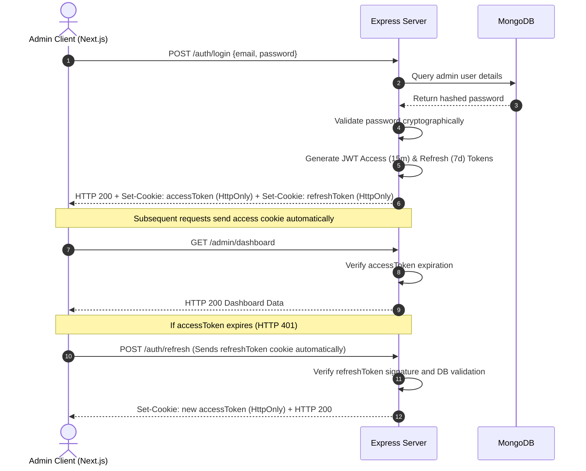

# API Specification & Authentication Design

This document details the REST API endpoints, security middleware configurations, and the request/response flows between the Next.js apps and the Express API server.

---

## 1. Global API Standards

- **Base URL**: `/api/v1`
- **Request Format**: `application/json`
- **Response Format**: `application/json`
- **Authentication Header**: Uses secure, `HttpOnly`, `SameSite=Strict`, `Secure` cookies for JWT tokens to block Cross-Site Scripting (XSS) and Cross-Site Request Forgery (CSRF).
- **Error Format**: All errors return a standardized format:
  ```json
  {
    "success": false,
    "message": "Error description text",
    "stack": "Stack trace (Only returned in Development mode)"
  }
  ```

---

## 2. API Endpoint Layout

### 2.1 Authentication Module (`/api/v1/auth`)

| Endpoint | Method | Auth Required | Description |
| :--- | :--- | :--- | :--- |
| `/login` | `POST` | None | Authenticate admin, issue JWT Access & Refresh token cookies. |
| `/refresh` | `POST` | None | Re-issue Access token cookie using refresh token cookie. |
| `/logout` | `POST` | None | Clear authentication cookies. |
| `/me` | `GET` | Admin | Validate current session and retrieve admin profile metadata. |

### 2.2 Public & Admin Content Modules

All public GET routes have high-performance caching (SSG/ISR revalidation webhooks). All POST/PUT/DELETE routes require authentication and trigger Vercel Edge Cache Purge events.

#### Projects (`/api/v1/projects`)
- `GET /` - Retrieve list of projects (supports filters `?category=SaaS` and search query `?search=respark`).
- `GET /:slug` - Retrieve detailed case study for a specific project.
- `POST /` [Admin] - Create a new project.
- `PUT /:id` [Admin] - Update project data.
- `DELETE /:id` [Admin] - Delete project.

#### Experiences & Education (`/api/v1/experiences`)
- `GET /` - Retrieve full work history and educational timeline.
- `POST /` [Admin] - Add history entry.
- `PUT /:id` [Admin] - Modify entry.
- `DELETE /:id` [Admin] - Remove entry.

#### Skills (`/api/v1/skills`)
- `GET /` - Retrieve all categorized skills.
- `POST /` [Admin] - Add technical skill.
- `PUT /:id` [Admin] - Update skill (order or proficiency).
- `DELETE /:id` [Admin] - Delete skill.

#### Site Settings & SEO (`/api/v1/settings`)
- `GET /` - Retrieve landing page assets, social links, SEO details.
- `PUT /` [Admin] - Update settings.
- `POST /resume` [Admin] - Upload new resume file to Cloudinary (Multipart form).

#### Messages / Lead Capture (`/api/v1/messages`)
- `POST /` - Public contact form submission (includes rate-limiting).
- `GET /` [Admin] - List received messages.
- `PUT /:id` [Admin] - Mark message as read/read toggle.
- `DELETE /:id` [Admin] - Delete message.

#### Dashboard & External Analytics (`/api/v1/stats`)
- `GET /github` - Retrieve cached GitHub contribution matrix.
- `GET /leetcode` - Retrieve cached LeetCode user statistics.
- `GET /spotify` - Retrieve current active track (or last played).
- `GET /visitors` [Admin] - Retrieve system metrics, visit graphs, and message volume logs.

---

## 3. High-Fidelity API Payload Examples

### 3.1 Session Authorization (`POST /api/v1/auth/login`)

**Request Payload**:
```json
{
  "email": "lakshraj2121@gmail.com",
  "password": "SecurePassword123!"
}
```

**Response (Success)**:
```json
{
  "success": true,
  "message": "Login successful",
  "user": {
    "id": "60d0fe4f5311236168a109ca",
    "username": "yjcodehub",
    "email": "lakshraj2121@gmail.com",
    "role": "admin"
  }
}
```
*Note: Tokens are injected into response headers via `Set-Cookie` (`accessToken` and `refreshToken`).*

---

### 3.2 Add Project (`POST /api/v1/projects`)

**Request Payload (Multipart / Form-Data)**:
- `title`: `FitPulse Pro`
- `category`: `Full Stack`
- `description`: `Mobile-first Gym tracker...`
- `technologies`: `["Next.js", "Tailwind CSS", "MongoDB"]`
- `featured`: `true`
- `thumbnail`: `[File Upload Bin]`

**Response**:
```json
{
  "success": true,
  "data": {
    "id": "60d0fe4f5311236168a109cb",
    "title": "FitPulse Pro",
    "slug": "fitpulse-pro",
    "category": "Full Stack",
    "description": "Mobile-first Gym tracker...",
    "technologies": ["Next.js", "Tailwind CSS", "MongoDB"],
    "thumbnail": "https://res.cloudinary.com/yjcodehub/image/upload/v12345/fitpulse.webp",
    "featured": true,
    "stats": { "stars": 0, "forks": 0 },
    "order": 1
  }
}
```

---

## 4. Authentication Flow Diagram

This diagram displays the secure cookie authentication and token re-issuance pattern:


