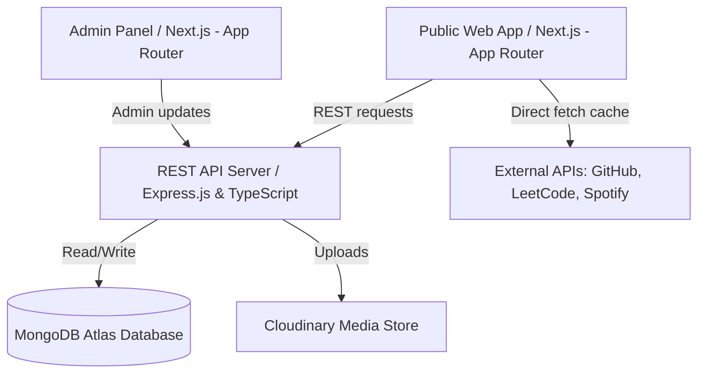

# Software Architecture & System Design

This document details the complete technical architecture for the premium developer portfolio. The system is designed to showcase Yashkumar Jais's engineering background, projects, work history, and custom statistics with a luxurious, Apple-esque UI while being managed dynamically by a custom admin dashboard.

---

## 1. System Overview

The system follows a headless architecture pattern:



- **Frontend Tier**: Built with **Next.js (App Router)** and TypeScript. The application splits into a high-performance, SEO-optimized **Public Website** (using Server-Side Rendering and Static Site Generation where appropriate) and a secure **Admin Panel** (using Client-Side rendering and Client Components).
- **Backend Tier**: A stateless **Express.js API Server** written in TypeScript. It handles JWT authentication, business logic, role-based access control, file upload processing, rate limiting, and API routing.
- **Database Tier**: **MongoDB Atlas** for document-oriented, schema-flexible storage. Mongoose acts as the ODM (Object Document Mapper).
- **Media Storage Tier**: **Cloudinary** for storing project assets (images, videos), resume PDFs, and certification credentials.

---

## 2. Directory Structures

The codebase is organized into two primary root directories: `frontend` and `backend`.

### 2.1 Backend Directory Tree

```
backend/
├── src/
│   ├── app.ts                  # Express application setup
│   ├── server.ts               # Server startup and database connections
│   ├── config/                 # Environment variables and configuration loaders
│   │   ├── db.ts               # MongoDB Mongoose configurations
│   │   └── cloudinary.ts       # Cloudinary client SDK setups
│   ├── controllers/            # Request handlers mapping to routes
│   │   ├── auth.controller.ts  # Admin session controllers
│   │   ├── project.controller.ts
│   │   ├── experience.controller.ts
│   │   ├── stats.controller.ts # LeetCode, Github, Spotify caches
│   │   └── message.controller.ts
│   ├── middleware/             # Express middlewares
│   │   ├── auth.middleware.ts  # JWT checks and authorization levels
│   │   ├── error.middleware.ts # Global unified error response handlers
│   │   ├── rateLimit.middleware.ts
│   │   └── upload.middleware.ts# Multer file storage parser
│   ├── models/                 # Mongoose schema definitions
│   │   ├── User.ts
│   │   ├── Project.ts
│   │   ├── Experience.ts
│   │   ├── Skill.ts
│   │   ├── Certificate.ts
│   │   └── Message.ts
│   ├── routes/                 # Express Router endpoints mapping
│   │   ├── index.ts            # Root API router (/api/v1)
│   │   ├── auth.routes.ts
│   │   ├── project.routes.ts
│   │   └── stats.routes.ts
│   ├── services/               # Core business logic / DB access layers
│   │   ├── github.service.ts   # Integrations with GitHub REST/GraphQL
│   │   └── leetcode.service.ts
│   ├── utils/                  # Helper modules
│   │   ├── logger.ts           # Winston-based logging systems
│   │   └── catchAsync.ts       # Utility to catch async Express errors
│   └── validators/             # Request schema validation blocks (Joi/Zod)
│       └── auth.validator.ts
├── .env.example
├── tsconfig.json
└── package.json
```

### 2.2 Frontend Directory Tree

```
frontend/
├── public/                     # Static files (favicons, WebP patterns, noise overlays)
├── src/
│   ├── app/                    # Next.js App Router (Layouts & Pages)
│   │   ├── layout.tsx          # Root HTML layout with providers (Theme, Lenis, Custom Cursor)
│   │   ├── page.tsx            # Premium Landing Page (Home, projects, timeline, skills, experience)
│   │   ├── globals.css         # Tailwind configurations & theme design tokens
│   │   ├── projects/           # Static/Dynamic case study pages
│   │   │   └── [slug]/
│   │   │       └── page.tsx
│   │   ├── blog/               # Markdown-rendered blogging module
│   │   │   ├── page.tsx
│   │   │   └── [slug]/
│   │   │       └── page.tsx
│   │   └── admin/              # Admin panel sub-folder
│   │       ├── layout.tsx      # Sidebar, top status bar, route protections
│   │       ├── page.tsx        # Login screen
│   │       ├── dashboard/      # Overview analytics charts and activity logs
│   │       │   └── page.tsx
│   │       ├── projects/       # Projects management forms (CRUD)
│   │       ├── experience/     # Work history & timeline management forms (CRUD)
│   │       └── messages/       # Contact form submissions and analytics logs
│   ├── components/             # Reusable UI widgets
│   │   ├── ui/                 # Atomic design components (Shadcn customized styles)
│   │   │   ├── button.tsx
│   │   │   ├── card.tsx
│   │   │   ├── dialog.tsx
│   │   │   └── input.tsx
│   │   ├── animation/          # Animation wrappers (GSAP/Framer Motion templates)
│   │   │   ├── RevealText.tsx
│   │   │   ├── TiltCard.tsx
│   │   │   ├── SpotLight.tsx
│   │   │   └── Magnetic.tsx
│   │   ├── terminal/           # Animated mock-terminal component
│   │   ├── canvas/             # Three.js canvas items for interactive backgrounds
│   │   └── layout/             # Structure layout elements
│   │       ├── Header.tsx
│   │       ├── Footer.tsx
│   │       └── Cursor.tsx      # Premium mouse-follower overlay
│   ├── hooks/                  # Custom React client hooks
│   │   ├── useLenis.ts
│   │   └── useShortcuts.ts
│   ├── lib/                    # SDK helpers (Axios/fetch clients, markdown parser)
│   │   ├── api.ts              # API Client wrapper
│   │   └── utils.ts            # Tailwind Merge utilities
│   ├── stores/                 # State management (Zustand)
│   │   └── useAdminStore.ts
│   └── types/                  # TypeScript interface mapping
│       └── index.ts
├── next.config.ts
├── tailwind.config.ts
├── postcss.config.mjs
├── tsconfig.json
└── package.json
```

---

## 3. UI Component Hierarchy

The page layouts are structured to enforce encapsulation and code reuse.

### 3.1 Public Website Component Tree

```
[Root Layout]
├── [Lenis Smooth Scroll Provider]
│   ├── [Header Component]
│   │   └── [Logo & Animated Navigation (Framer Motion)]
│   │   └── [Theme Toggle]
│   ├── [Mouse Follower Canvas]
│   ├── [Command Palette Overlay]
│   └── [Page View Wrapper (Layout transition hooks)]
│       ├── [Hero Section]
│       │   ├── [Floating Gradients Mesh]
│       │   ├── [Text Reveal Animation (Split-type)]
│       │   └── [Animated Code Terminal]
│       ├── [About / Services Section]
│       │   └── [Grid of Spotlight Spotlight Cards (Aceternity UI)]
│       ├── [Experience Timeline Section]
│       │   └── [Interactive Timeline (GSAP scroll trigger reveal)]
│       ├── [Projects Grid Section]
│       │   ├── [Dynamic Category Filters]
│       │   └── [Tilt Cards (3D Morph on hover + Custom Reveal)]
│       ├── [Tech Stack & Skills Section]
│       │   ├── [Infinite Running Logo Carousel]
│       │   └── [Skill Level Bars / Radar Graph (Three.js/Canvas option)]
│       ├── [External Metrics Section]
│       │   ├── [GitHub Contribution Graph Widget]
│       │   └── [LeetCode Metrics Stats Widget]
│       ├── [Contact Section]
│       │   ├── [Premium Contact Form]
│       │   └── [Floating Social Links Menu (Magnetic buttons)]
│       └── [Footer Component]
```

### 3.2 Admin Panel Component Tree

```
[Admin Layout]
├── [Route Protection Guard]
│   ├── [Sidebar Navigation]
│   │   └── [Link Items with active states]
│   ├── [Top Admin Header]
│   │   ├── [Quick Analytics summary badges]
│   │   └── [Log Out button]
│   └── [Workspace Viewport]
│       ├── [Dashboard View]
│       │   ├── [Visitor Counter chart (Recharts/ChartJS)]
│       │   └── [System activity logs]
│       ├── [Projects Manager (CRUD)]
│       │   ├── [Projects Table]
│       │   └── [Dynamic Modal Form (Dynamic fields, image drag-n-drop)]
│       ├── [Experience & Education Manager]
│       ├── [Settings Portal]
│       │   ├── [General Settings Form]
│       │   ├── [SEO Metadata Input fields]
│       │   └── [File Upload (Cloudinary connector for Resume PDFs)]
│       └── [Messages Center]
│           └── [Message inbox list with mark-read/delete actions]
```

---

## 4. Scalability Plan

To ensure the portfolio is lightning fast and scales under heavy traffic spikes, we implement the following:

- **Edge Caching**: Next.js Server Components and Static Site Generation (SSG) for static sections (About, Skills, Experience) cached on Vercel's Global CDN edge.
- **Incremental Static Regeneration (ISR)**: The public pages revalidate their data dynamically in the background every 60 minutes. Whenever the database content changes (e.g. adding a new project or updating resume data), the Admin API triggers an **On-Demand Revalidation** webhook to purge CDN cache on Vercel immediately.
- **External API Cache-Aside**: Metrics from third-party services (GitHub activity, LeetCode stats) are fetched periodically via a backend cron task (runs every 12 hours) and cached in MongoDB. This protects third-party API rate limits and prevents page load delays.
- **Media Optimization**: Images/videos are processed automatically by Cloudinary (using dynamic URL parameters `q_auto` and `f_auto` to serve compressed WebP/AVIF images and MP4 files optimized for screen size).

---

## 5. Deployment Strategy

The environment will be deployed without complex containerization (Docker-free) using production SaaS platforms:

- **Frontend Deployment (Vercel)**:
  - Deploys Next.js dynamically.
  - Automatically runs builds on git push.
  - Hosts Edge Functions for routing and server-side headers.
- **Backend Deployment (Railway / Render)**:
  - Deploys node server directly from git.
  - Environment variables set up via Railway dashboard.
  - Integrates logger output for system audits.
- **Database (MongoDB Atlas)**:
  - Free/Shared cluster tier with automatic scaling, replication, and standard TLS encryption.
- **File Assets (Cloudinary)**:
  - Asset repository serving images and document downloads.
