# Project Roadmap & Implementation Milestones

This document details the development lifecycle, milestone breakdowns, estimated timelines, and the future-proofing roadmap for the premium developer portfolio.

---

## 1. Development Phases

The project is structured into 5 logical phases, prioritizing architectural integrity and core mechanics before layering on complex UI animations.

```mermaid
gantt
    title Portfolio Development Timeline
    dateFormat  X
    axisFormat %d
    section Phase 1: Foundation
    Setup & Configs             :active, p1, 0, 10
    section Phase 2: Backend
    DB & REST Endpoints         :p2, 10, 25
    section Phase 3: Public UI
    Layouts & GSAP Motion       :p3, 25, 50
    section Phase 4: Admin CRUD
    Forms & Media Manager       :p4, 50, 75
    section Phase 5: Verification
    Lighthouse Optimization & QA:p5, 75, 90
```

---

## 2. Milestone Breakdowns

### Phase 1: Architecture & Foundations (Estimated: 12 Hours)
- Set up backend structure with TypeScript and Express configs.
- Initialize Next.js frontend with Tailwind CSS, customized theme variables, and global layout files.
- Configure Lenis smooth scrolling, base custom cursor hook, and Global navigation controls.

### Phase 2: Database & Backend API Development (Estimated: 24 Hours)
- Configure Mongoose model connections.
- Implement Express Router mapping for Auth, Projects, Experiences, Skills, Settings, and Messages.
- Implement JSON Web Token (JWT) authorization middleware with HttpOnly cookie parsing.
- Integrate Cloudinary storage sdk for document/image processing.
- Create automated cron-jobs to cache external profiles (GitHub graph, LeetCode metrics).

### Phase 3: Public UI/UX & Motion Systems (Estimated: 35 Hours)
- Implement layout components: Header, Navigation bar, Custom Cursor follower canvas.
- Construct Hero section featuring the animated Typing Terminal.
- Develop interactive, GSAP scroll-triggered Experience Timeline.
- Code the Projects Grid with category filters, searching, and 3D Card Hover animations.
- Integrate active third-party metrics widgets (GitHub contributions grid, LeetCode rings, Spotify player).
- Integrate Contact Form with rate-limiting, validations, and toast notifications.

### Phase 4: Secure Admin Dashboard (Estimated: 25 Hours)
- Build Auth Login form container with redirect guards.
- Code Dashboard overview interface showing analytic summaries (page views, submissions).
- Implement CRUD operations for Projects, Experiences, Skills, and Certificates.
- Implement file-upload interface allowing drag-and-drop file inputs (connected to Cloudinary for new project media and CV document replacements).
- Build Contact messages reader with read/unread flags.

### Phase 5: Testing, Optimizations, & Launch (Estimated: 15 Hours)
- Run Lighthouse audits. Fix accessibility scores and image format configurations.
- Verify meta tags, Sitemap generator hooks, and OpenGraph parameters.
- Conduct cross-device responsive layout checks (iOS Safari, Android Chrome, Windows/Mac desktop browsers).
- Set up API rate-limiting rules.
- Deploy to Vercel and Railway/Render. Connect custom domains.

**Total Project Estimate**: **111 Development Hours**

---

## 3. Future Roadmap

Features planned for development in Phase 6:

- **Markdown Blog Support**: Add `/blog` page allowing Yashkumar to publish technical blogs parsed dynamically from Markdown records stored in MongoDB.
- **Progressive Web App (PWA)**: Implement `next-pwa` configurations to enable offline application support and home screen installation options.
- **Spotify Integration (OAuth)**: Expand Now Playing to support a persistent backend Spotify account pairing interface inside the admin panel, fetching current user play queues.
- **RSS Feed & Atom Sync**: Automated XML syndication generation for newly published blog articles to support RSS feed aggregators.
